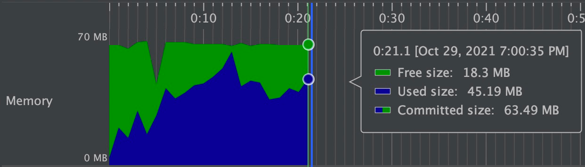

EasyExcel
======================
[](https://travis-ci.org/alibaba/easyexcel)
[](https://maven-badges.herokuapp.com/maven-central/com.alibaba/easyexcel)
[](http://www.apache.org/licenses/LICENSE-2.0.html)

[QQ群: 662022184](//shang.qq.com/wpa/qunwpa?idkey=53d9d821b0833e3c14670f007488a61e300f00ff4f1b81fd950590d90dd80f80)
[钉钉1群（已满）: 21960511](https://qr.dingtalk.com/action/joingroup?code=v1,k1,cchz6k12ci9B08NNqhNRFGXocNVHrZtW0kaOtTKg/Rk=&_dt_no_comment=1&origin=11)
[钉钉2群: 32796397](https://qr.dingtalk.com/action/joingroup?code=v1,k1,jyU9GtEuNU5S0QTyklqYcYJ8qDZtUuTPMM7uPZTS8Hs=&_dt_no_comment=1&origin=11)

[官方网站: https://yuque.com/easyexcel](https://www.yuque.com/easyexcel/doc/easyexcel)

[常见问题](https://www.yuque.com/easyexcel/faq)
#### 因为公司不方便用QQ，所以建议加钉钉群

# JAVA解析Excel工具EasyExcel
Java解析、生成Excel比较有名的框架有Apache poi、jxl。但他们都存在一个严重的问题就是非常的耗内存，poi有一套SAX模式的API可以一定程度的解决一些内存溢出的问题，但POI还是有一些缺陷，比如07版Excel解压缩以及解压后存储都是在内存中完成的，内存消耗依然很大。easyexcel重写了poi对07版Excel的解析，能够原本一个3M的excel用POI sax依然需要100M左右内存降低到几M，并且再大的excel不会出现内存溢出，03版依赖POI的sax模式。在上层做了模型转换的封装，让使用者更加简单方便

## 64M内存1分钟内读取75M(46W行25列)的Excel
当然还有急速模式能更快，但是内存占用会在100M多一点


## 相关文档
* [快速开始](https://www.yuque.com/easyexcel/doc/easyexcel)
* [关于软件](/abouteasyexcel.md)
* [更新记事](/update.md)
* [贡献代码](https://www.yuque.com/easyexcel/doc/contribute)

## 维护者
玉霄、庄家钜、怀宇
## 快速开始
### 读Excel
DEMO代码地址：[https://github.com/alibaba/easyexcel/blob/master/src/test/java/com/alibaba/easyexcel/demo/read/ReadTest.java](/src/test/java/com/alibaba/easyexcel/test/demo/read/ReadTest.java)

```java
    /**
     * 最简单的读
     * <p>1. 创建excel对应的实体对象 参照{@link DemoData}
     * <p>2. 由于默认一行行的读取excel，所以需要创建excel一行一行的回调监听器，参照{@link DemoDataListener}
     * <p>3. 直接读即可
     */
    @Test
    public void simpleRead() {
        String fileName = TestFileUtil.getPath() + "demo" + File.separator + "demo.xlsx";
        // 这里 需要指定读用哪个class去读，然后读取第一个sheet 文件流会自动关闭
        EasyExcel.read(fileName, DemoData.class, new DemoDataListener()).sheet().doRead();
    }
```

### 写Excel
DEMO代码地址：[https://github.com/alibaba/easyexcel/blob/master/src/test/java/com/alibaba/easyexcel/test/demo/write/WriteTest.java](/src/test/java/com/alibaba/easyexcel/test/demo/write/WriteTest.java)
```java
    /**
     * 最简单的写
     * <p>1. 创建excel对应的实体对象 参照{@link com.alibaba.easyexcel.test.demo.write.DemoData}
     * <p>2. 直接写即可
     */
    @Test
    public void simpleWrite() {
        String fileName = TestFileUtil.getPath() + "write" + System.currentTimeMillis() + ".xlsx";
        // 这里 需要指定写用哪个class去读，然后写到第一个sheet，名字为模板 然后文件流会自动关闭
        // 如果这里想使用03 则 传入excelType参数即可
        EasyExcel.write(fileName, DemoData.class).sheet("模板").doWrite(data());
    }
```

### web上传、下载
DEMO代码地址：[https://github.com/alibaba/easyexcel/blob/master/src/test/java/com/alibaba/easyexcel/test/demo/web/WebTest.java](/src/test/java/com/alibaba/easyexcel/test/demo/web/WebTest.java)
```java
 /**
     * 文件下载（失败了会返回一个有部分数据的Excel）
     * <p>1. 创建excel对应的实体对象 参照{@link DownloadData}
     * <p>2. 设置返回的 参数
     * <p>3. 直接写，这里注意，finish的时候会自动关闭OutputStream,当然你外面再关闭流问题不大
     */
    @GetMapping("download")
    public void download(HttpServletResponse response) throws IOException {
        // 这里注意 有同学反应使用swagger 会导致各种问题，请直接用浏览器或者用postman
        response.setContentType("application/vnd.ms-excel");
        response.setCharacterEncoding("utf-8");
        // 这里URLEncoder.encode可以防止中文乱码 当然和easyexcel没有关系
        String fileName = URLEncoder.encode("测试", "UTF-8");
        response.setHeader("Content-disposition", "attachment;filename=" + fileName + ".xlsx");
        EasyExcel.write(response.getOutputStream(), DownloadData.class).sheet("模板").doWrite(data());
    }

    /**
     * 文件上传
     * <p>1. 创建excel对应的实体对象 参照{@link UploadData}
     * <p>2. 由于默认一行行的读取excel，所以需要创建excel一行一行的回调监听器，参照{@link UploadDataListener}
     * <p>3. 直接读即可
     */
    @PostMapping("upload")
    @ResponseBody
    public String upload(MultipartFile file) throws IOException {
        EasyExcel.read(file.getInputStream(), UploadData.class, new UploadDataListener(uploadDAO)).sheet().doRead();
        return "success";
    }
```
### 联系我们
有问题阿里同事可以通过钉钉找到我，阿里外同学可以通过git留言。其他技术非技术相关的也欢迎一起探讨。
### 招聘&交流
阿里巴巴新零售事业部--诚招JAVA资深开发、技术专家。有意向可以微信联系，简历可以发我邮箱jipengfei.jpf@alibaba-inc.com
