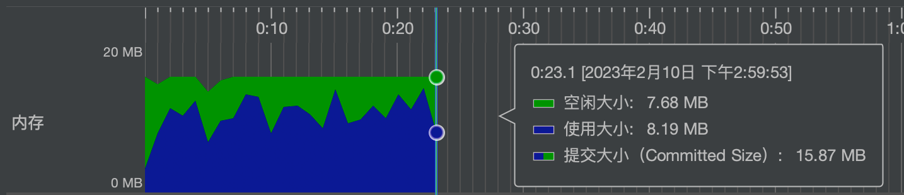

EasyExcel
======================
[](https://github.com/alibaba/easyexcel/actions/workflows/ci.yml?query=branch%3Amaster)
[](https://maven-badges.herokuapp.com/maven-central/com.alibaba/easyexcel)
[](http://www.apache.org/licenses/LICENSE-2.0.html)
[](https://opensource.alibaba.com/contribution_leaderboard/details?projectValue=easyexcel)
# Related Documents
* [Offical Website](https://easyexcel.opensource.alibaba.com)
* [Quick Start](https://easyexcel.opensource.alibaba.com/docs/current/)
* [About Us](/abouteasyexcel.md)
* [Update Notes](/update.md)
* [Code Contribution](/CONTRIBUTING.md)

# EasyExcel, a Java toolkit for parsing Excel easily
There are several Java frameworks or toolkits which can parse and generate Excel, such as Apache POI or jxl. But they all have some difficulties to handle problems like excessive memory usage. Apache POI framework has a set of SAX mode API can fix some memory overflow problems at some extent, but it still has some flaws. For example, the unzipping and the storage of the unzipping of Excel file in version 07 are done in memory, so the memory consumption is still very high. The EasyExcel toolkit rewrites the logic of POI for parsing Excel version 07. One 3 megabytes Excel file parsed with POI still requires about 100M memory, which can be reduced to a few megabyte by using EasyExcel instead. And yes, there is no memory overflow for even larger Excel with EasyExcel. EasyExcel version 03 depends on POI SAX model and does model transformation/encapsulation in the upper layer to make it simpler and more convenient for users.

## Using EasyExcel version 3.0.2+, a machine with 64M RAM can read a 75 megabyte Excel file containing 460,000 rows and 25 columns in 20 seconds
Of course, there is also a very fast mode can be faster, but the memory consumption will be a little more than 100M


## Version support
* EasyExcel version 2+ works on JDK7 or JDK6
* EasyExcel version 3+ works on JDK8 or JDK8+
### About version upgrade
* It is not recommended upgrading across major versions, especially across 2 major versions.
* There are some incompatibilities in upgrading from version 2+ to version 3+.
  * Using a custom interceptor to modify the style can cause problems, even if it does not compile with errors.
  * When reading the Excel file, the `invoke` function will throw an exception, there will not be an additional layer of `ExcelAnalysisException` wrapped here, and it will not compile with errors.
  * Style and other annotations involving `boolean` or some enumeration values have been changed, adding the default value. The compiler will report an error, just change the annotation.
* It is recommended to re-test the relevant functions after upgrading across major versions.

# Latest Version
```xml
        <dependency>
            <groupId>com.alibaba</groupId>
            <artifactId>easyexcel</artifactId>
            <version>4.0.1</version>
        </dependency>
```
# How to get help
## Solving problems through documents is promoted

* [Quick Start](https://easyexcel.opensource.alibaba.com/docs/current/)
* [FAQ](https://easyexcel.opensource.alibaba.com/docs/qa/)
* [API](https://easyexcel.opensource.alibaba.com/docs/current/api/)

## It is recommended to solve the problem through `issues`

Try searching for the issue at the following 2 links, and if it doesn't exist try creating an `issue`.

* Go to [github](https://github.com/alibaba/easyexcel/issues) and search for `issues`.
* Go to [gitee](https://gitee.com/easyexcel/easyexcel/issues) and search for `issues`.

Solving a problem via `issues` is recommended because it can be viewed later by users who encounter the same problem.   
No matter `github` or `gitee`, there will be someone to answer your question regularly. If it's urgent, you can send an `issue` address to the group owner after you've raised an `issue` in the pinned group to help you solve the problem.


## Join DingTalk & QQ group to discuss the problem

Join DingTalk or QQ group to get help after reading the announcement.  
We recommend the `DingTalk`. For some reasons, some of the project's maintainers are unable to use QQ during working hours.Of course, QQ group will have enthusiastic users to help solve the problem.   
[History Discussion Group Collection](/DISCUSSIONGROUP.md)   
[Communication Group 8 in QQ: 113968681](https://qm.qq.com/q/qwfl5RRBAG)   
[Communication Group 13 in DingTalk:83695000992](https://qr.dingtalk.com/action/joingroup?code=v1,k1,2JFUbWfxD1fGiq7LRW+mYjcK7s7onp/s1ZqOvfzkFGE=&_dt_no_comment=1&origin=11)

# Maintainers
姬朋飞（玉霄)、庄家钜、怀宇
# Quick Start
## Read Excel File
DEMO：[https://github.com/alibaba/easyexcel/blob/master/easyexcel-test/src/test/java/com/alibaba/easyexcel/test/demo/read/ReadTest.java](https://github.com/alibaba/easyexcel/blob/master/easyexcel-test/src/test/java/com/alibaba/easyexcel/test/demo/read/ReadTest.java)

Detailed Document：[https://easyexcel.opensource.alibaba.com/docs/current/quickstart/read](https://easyexcel.opensource.alibaba.com/docs/current/quickstart/read)
```java
    /**
     * The easiest way to read Excel file using EasyExcel toolkit
     *
     * <p>
     *     1. Create an entity object, such as {@link DemoData}, each property of the entity object corresponds to a specific field in any row of Excel.
     *     2. When reading each row of an Excel file, create a callback listener for the corresponding row. Refer to{@link DemoDataListener}
     *     3. Invoke the read function
     * </p>
     */
    @Test
    public void simpleRead() {
        String fileName = TestFileUtil.getPath() + "demo" + File.separator + "demo.xlsx";
        // Specify which entity object class to use to read the Excel content. The file stream will close automatically after reading the first sheet of Excel.
        EasyExcel.read(fileName, DemoData.class, new DemoDataListener()).sheet().doRead();
    }
```
## Write Excel File
DEMO：[https://github.com/alibaba/easyexcel/blob/master/easyexcel-test/src/test/java/com/alibaba/easyexcel/test/demo/write/WriteTest.java](https://github.com/alibaba/easyexcel/blob/master/easyexcel-test/src/test/java/com/alibaba/easyexcel/test/demo/write/WriteTest.java)

Detailed Document：[https://easyexcel.opensource.alibaba.com/docs/current/quickstart/write](https://easyexcel.opensource.alibaba.com/docs/current/quickstart/write)
```java
    /**
     * The easiest way to write Excel file using EasyExcel toolkit
     *
     * <p>
     *     1. Create an entity object, refer to{@link com.alibaba.easyexcel.test.demo.write.DemoData}. 
     *        Each property of the entity object corresponds to a specific field of Excel
     *     2. Invoke write function
     * </p>
     */
    @Test
    public void simpleWrite() {
        String fileName = TestFileUtil.getPath() + "write" + System.currentTimeMillis() + ".xlsx";
        // Specify which entity object class to use to write Excel, it will write to the first sheet of Excel with the name template. Then the file stream will be closed automatically.
        // With version 03, just pass in the excelType parameter
        EasyExcel.write(fileName, DemoData.class).sheet("template").doWrite(data());
    }
```

## File Uploading&Downloading
DEMO：[https://github.com/alibaba/easyexcel/blob/master/easyexcel-test/src/test/java/com/alibaba/easyexcel/test/demo/web/WebTest.java](https://github.com/alibaba/easyexcel/blob/master/easyexcel-test/src/test/java/com/alibaba/easyexcel/test/demo/web/WebTest.java)
```java
   /**
     * File downloading
     *
     * Note: returns an Excel with partial data if it fails
     *
     * <p>
     *  1. Create an entity object, refer to{@link DownloadData}. 
     *     Each property of the entity object corresponds to a specific field of Excel
     *  2. Specify the returned properties
     *  3. Invoke write function, then the OutputStream is automatically closed when it ends.
     * </p>
     */
    @GetMapping("download")
    public void download(HttpServletResponse response) throws IOException {
        // Using swagger may cause some problems, please use your browser directly or use postman to invoke this
        response.setContentType("application/vnd.openxmlformats-officedocument.spreadsheetml.sheet");
        response.setCharacterEncoding("utf-8");
        // URLEncoder.encode function can prevent Chinese garbled code 
        String fileName = URLEncoder.encode("test", "UTF-8").replaceAll("\\+", "%20");
        response.setHeader("Content-disposition", "attachment;filename*=utf-8''" + fileName + ".xlsx");
        EasyExcel.write(response.getOutputStream(), DownloadData.class).sheet("template").doWrite(data());
    }

    /**
     * File uploading
     *
     * <p>
     *     1. Create an entity object, refer to{@link UploadData}
     *        Each property of the entity object corresponds to a specific field of Excel
     *     2. When reading each row of an Excel file, create a callback listener for the corresponding row. Refer to{@link UploadDataListener}
     *     3. Invoke read function
     * </p>
     */
    @PostMapping("upload")
    @ResponseBody
    public String upload(MultipartFile file) throws IOException {
        EasyExcel.read(file.getInputStream(), UploadData.class, new UploadDataListener(uploadDAO)).sheet().doRead();
        return "success";
    }
```

# Contact Us
If you have any questions, Alibaba colleagues can find me in DingTalk, and others can leave messages here. All related questions are well welcomed.
