# easyexcel核心功能
## 各位读取文件务必使用2.0.3起
2.0.0-beta1到2.0.2有小概率会丢失数字。
## 目录
### 前言
#### 以下功能目前不支持
* 单个文件的并发写入、读取
* 读取图片
* 宏
* csv读取（这个后续可能会考虑）
#### 常见问题
* 关于@Data，读写的对象都用到了[Lombok](https://www.projectlombok.org/),他会自动生成`get`,`set` ，如果不需要的话，自己创建对象并生成`get`,`set` 。
* 如果在读的时候`Listener`里面需要使用spring的`@Autowired`，给`Listener`创建成员变量，然后在构造方法里面传进去。而别必须不让spring管理`Listener`，每次读取都要`new`一个。
* 如果用`String`去接收数字，出现小数点等情况，这个是BUG，但是很难修复，后续版本会修复这个问题。目前请使用`@NumberFormat`直接，里面的参数就是调用了java自带的`NumberFormat.format`方法，不知道怎么入参的可以自己网上查询。
#### 详细参数介绍
有些参数不知道怎么用，或者有些功能不知道用什么参数，参照：[详细参数介绍](/docs/API.md)
#### 开源项目不容易，如果觉得本项目对您的工作还是有帮助的话，请在右上角帮忙点个★Star。
### 读
DEMO代码地址：[https://github.com/alibaba/easyexcel/blob/master/src/test/java/com/alibaba/easyexcel/demo/read/ReadTest.java](/src/test/java/com/alibaba/easyexcel/test/demo/read/ReadTest.java)
* [最简单的读](#simpleRead)
* [指定列的下标或者列名](#indexOrNameRead)
* [读多个sheet](#repeatedRead)
* [日期、数字或者自定义格式转换](#converterRead)
* [多行头](#complexHeaderRead)
* [同步的返回](#synchronousRead)
* [读取表头数据](#headerRead)
* [数据转换等异常处理](#exceptionRead)
* [web中的读](#webRead)

### 写
DEMO代码地址：[https://github.com/alibaba/easyexcel/blob/master/src/test/java/com/alibaba/easyexcel/test/demo/write/WriteTest.java](/src/test/java/com/alibaba/easyexcel/test/demo/write/WriteTest.java)
* [最简单的写](#simpleWrite)
* [指定写入的列](#indexWrite)
* [复杂头写入](#complexHeadWrite)
* [重复多次写入（包括不同sheet）](#repeatedWrite)
* [日期、数字或者自定义格式转换](#converterWrite)
* [图片导出](#imageWrite)
* [根据模板写入](#templateWrite)
* [列宽、行高](#widthAndHeightWrite)
* [自定义样式](#styleWrite)
* [合并单元格](#mergeWrite)
* [使用table去写入](#tableWrite)
* [动态头，实时生成头写入](#dynamicHeadWrite)
* [自动列宽(不太精确)](#longestMatchColumnWidthWrite)
* [自定义拦截器（下拉，超链接等上面几点都不符合但是要对单元格进行操作的参照这个）](#customHandlerWrite)
* [web中的写](#webWrite)

## 读excel样例
### <span id="simpleRead" />最简单的读
##### <span id="simpleReadExcel" />excel示例
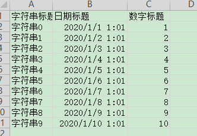
##### <span id="simpleReadObject" />对象
```java
@Data
public class DemoData {
    private String string;
    private Date date;
    private Double doubleData;
}
```
##### <span id="simpleReadListener" />监听器
```java
public class DemoDataListener extends AnalysisEventListener<DemoData> {
    private static final Logger LOGGER = LoggerFactory.getLogger(DemoDataListener.class);
    /**
     * 每隔5条存储数据库，实际使用中可以3000条，然后清理list ，方便内存回收
     */
    private static final int BATCH_COUNT = 5;
    List<DemoData> list = new ArrayList<DemoData>();

    @Override
    public void invoke(DemoData data, AnalysisContext context) {
        LOGGER.info("解析到一条数据:{}", JSON.toJSONString(data));
        list.add(data);
        if (list.size() >= BATCH_COUNT) {
            saveData();
            list.clear();
        }
    }

    @Override
    public void doAfterAllAnalysed(AnalysisContext context) {
        saveData();
        LOGGER.info("所有数据解析完成！");
    }

    /**
     * 加上存储数据库
     */
    private void saveData() {
        LOGGER.info("{}条数据，开始存储数据库！", list.size());
        LOGGER.info("存储数据库成功！");
    }
}
```
##### 代码
```java
    /**
     * 最简单的读
     * <p>1. 创建excel对应的实体对象 参照{@link DemoData}
     * <p>2. 由于默认异步读取excel，所以需要创建excel一行一行的回调监听器，参照{@link DemoDataListener}
     * <p>3. 直接读即可
     */
    @Test
    public void simpleRead() {
        // 写法1：
        String fileName = TestFileUtil.getPath() + "demo" + File.separator + "demo.xlsx";
        // 这里 需要指定读用哪个class去读，然后读取第一个sheet 文件流会自动关闭
        EasyExcel.read(fileName, DemoData.class, new DemoDataListener()).sheet().doRead();

        // 写法2：
        fileName = TestFileUtil.getPath() + "demo" + File.separator + "demo.xlsx";
        ExcelReader excelReader = EasyExcel.read(fileName, DemoData.class, new DemoDataListener()).build();
        ReadSheet readSheet = EasyExcel.readSheet(0).build();
        excelReader.read(readSheet);
        // 这里千万别忘记关闭，读的时候会创建临时文件，到时磁盘会崩的
        excelReader.finish();
    }
```

### <span id="indexOrNameRead" />指定列的下标或者列名
##### excel示例
参照：[excel示例](#simpleReadExcel)
##### 对象
```java
@Data
public class IndexOrNameData {
    /**
     * 强制读取第三个 这里不建议 index 和 name 同时用，要么一个对象只用index，要么一个对象只用name去匹配
     */
    @ExcelProperty(index = 2)
    private Double doubleData;
    /**
     * 用名字去匹配，这里需要注意，如果名字重复，会导致只有一个字段读取到数据
     */
    @ExcelProperty("字符串标题")
    private String string;
    @ExcelProperty("日期标题")
    private Date date;
}
```
##### 监听器
参照：[监听器](#simpleReadListener) 只是泛型变了而已
##### 代码
```java
    /**
     * 指定列的下标或者列名
     *
     * <p>1. 创建excel对应的实体对象,并使用{@link ExcelProperty}注解. 参照{@link IndexOrNameData}
     * <p>2. 由于默认异步读取excel，所以需要创建excel一行一行的回调监听器，参照{@link IndexOrNameDataListener}
     * <p>3. 直接读即可
     */
    @Test
    public void indexOrNameRead() {
        String fileName = TestFileUtil.getPath() + "demo" + File.separator + "demo.xlsx";
        // 这里默认读取第一个sheet
        EasyExcel.read(fileName, IndexOrNameData.class, new IndexOrNameDataListener()).sheet().doRead();
    }
```

### <span id="repeatedRead" />读多个sheet
##### excel示例
参照：[excel示例](#simpleReadExcel)
##### 对象
参照：[对象](#simpleReadObject)
##### 监听器
参照：[监听器](#simpleReadListener)
##### 代码
```java
    /**
     * 读多个sheet,这里注意一个sheet不能读取多次，多次读取需要重新读取文件
     * <p>
     * 1. 创建excel对应的实体对象 参照{@link DemoData}
     * <p>
     * 2. 由于默认异步读取excel，所以需要创建excel一行一行的回调监听器，参照{@link DemoDataListener}
     * <p>
     * 3. 直接读即可
     */
    @Test
    public void repeatedRead() {
        // 方法1 如果 sheet1 sheet2 都是同一数据 监听器和头 都写到最外层
        String fileName = TestFileUtil.getPath() + "demo" + File.separator + "demo.xlsx";
        ExcelReader excelReader = EasyExcel.read(fileName, DemoData.class, new DemoDataListener()).build();
        ReadSheet readSheet1 = EasyExcel.readSheet(0).build();
        ReadSheet readSheet2 = EasyExcel.readSheet(1).build();
        excelReader.read(readSheet1);
        excelReader.read(readSheet2);
        // 这里千万别忘记关闭，读的时候会创建临时文件，到时磁盘会崩的
        excelReader.finish();

        // 方法2 如果 sheet1 sheet2 数据不一致的话
        fileName = TestFileUtil.getPath() + "demo" + File.separator + "demo.xlsx";
        excelReader = EasyExcel.read(fileName).build();
        // 这里为了简单 所以注册了 同样的head 和Listener 自己使用功能必须不同的Listener
        readSheet1 = EasyExcel.readSheet(0).head(DemoData.class).registerReadListener(new DemoDataListener()).build();
        readSheet2 = EasyExcel.readSheet(1).head(DemoData.class).registerReadListener(new DemoDataListener()).build();
        excelReader.read(readSheet1);
        excelReader.read(readSheet2);
        // 这里千万别忘记关闭，读的时候会创建临时文件，到时磁盘会崩的
        excelReader.finish();
    }
```

### <span id="converterRead" />日期、数字或者自定义格式转换
##### excel示例
参照：[excel示例](#simpleReadExcel)
##### 对象
```java
@Data
public class ConverterData {
    /**
     * 我自定义 转换器，不管数据库传过来什么 。我给他加上“自定义：”
     */
    @ExcelProperty(converter = CustomStringStringConverter.class)
    private String string;
    /**
     * 这里用string 去接日期才能格式化。我想接收年月日格式
     */
    @DateTimeFormat("yyyy年MM月dd日HH时mm分ss秒")
    private String date;
    /**
     * 我想接收百分比的数字
     */
    @NumberFormat("#.##%")
    private String doubleData;
}
```
##### 监听器
参照：[监听器](#simpleReadListener) 只是泛型变了
##### 自定义转换器
````java
public class CustomStringStringConverter implements Converter<String> {
    @Override
    public Class supportJavaTypeKey() {
        return String.class;
    }

    @Override
    public CellDataTypeEnum supportExcelTypeKey() {
        return CellDataTypeEnum.STRING;
    }

    /**
     * 这里读的时候会调用
     *
     * @param cellData
     *            NotNull
     * @param contentProperty
     *            Nullable
     * @param globalConfiguration
     *            NotNull
     * @return
     */
    @Override
    public String convertToJavaData(CellData cellData, ExcelContentProperty contentProperty,
        GlobalConfiguration globalConfiguration) {
        return "自定义：" + cellData.getStringValue();
    }

    /**
     * 这里是写的时候会调用 不用管
     *
     * @param value
     *            NotNull
     * @param contentProperty
     *            Nullable
     * @param globalConfiguration
     *            NotNull
     * @return
     */
    @Override
    public CellData convertToExcelData(String value, ExcelContentProperty contentProperty,
        GlobalConfiguration globalConfiguration) {
        return new CellData(value);
    }

}
````
##### 代码
```java
    /**
     * 日期、数字或者自定义格式转换
     * <p>
     * 默认读的转换器{@link DefaultConverterLoader#loadDefaultReadConverter()}
     * <p>1. 创建excel对应的实体对象 参照{@link ConverterData}.里面可以使用注解{@link DateTimeFormat}、{@link NumberFormat}或者自定义注解
     * <p>2. 由于默认异步读取excel，所以需要创建excel一行一行的回调监听器，参照{@link ConverterDataListener}
     * <p>3. 直接读即可
     */
    @Test
    public void converterRead() {
        String fileName = TestFileUtil.getPath() + "demo" + File.separator + "demo.xlsx";
        // 这里 需要指定读用哪个class去读，然后读取第一个sheet 然后千万别忘记 finish
        EasyExcel.read(fileName, ConverterData.class, new ConverterDataListener())
            // 这里注意 我们也可以registerConverter来指定自定义转换器， 但是这个转换变成全局了， 所有java为string,excel为string的都会用这个转换器。
            // 如果就想单个字段使用请使用@ExcelProperty 指定converter
            // .registerConverter(new CustomStringStringConverter())
            // 读取sheet
            .sheet().doRead();
    }
```

### <span id="complexHeaderRead" />多行头
##### excel示例
参照：[excel示例](#simpleReadExcel)
##### 对象
参照：[对象](#simpleReadObject)
##### 监听器
参照：[监听器](#simpleReadListener)
##### 代码
```java
    /**
     * 多行头
     *
     * <p>1. 创建excel对应的实体对象 参照{@link DemoData}
     * <p>2. 由于默认异步读取excel，所以需要创建excel一行一行的回调监听器，参照{@link DemoDataListener}
     * <p>3. 设置headRowNumber参数，然后读。 这里要注意headRowNumber如果不指定， 会根据你传入的class的{@link ExcelProperty#value()}里面的表头的数量来决定行数，
     * 如果不传入class则默认为1.当然你指定了headRowNumber不管是否传入class都是以你传入的为准。
     */
    @Test
    public void complexHeaderRead() {
        String fileName = TestFileUtil.getPath() + "demo" + File.separator + "demo.xlsx";
        // 这里 需要指定读用哪个class去读，然后读取第一个sheet 然后千万别忘记 finish
        EasyExcel.read(fileName, DemoData.class, new DemoDataListener()).sheet()
            // 这里可以设置1，因为头就是一行。如果多行头，可以设置其他值。不传入也可以，因为默认会根据DemoData 来解析，他没有指定头，也就是默认1行
            .headRowNumber(1).doRead();
    }
```

### <span id="synchronousRead" />同步的返回
##### excel示例
参照：[excel示例](#simpleReadExcel)
##### 对象
参照：[对象](#simpleReadObject)
##### 代码
```java
    /**
     * 同步的返回，不推荐使用，如果数据量大会把数据放到内存里面
     */
    @Test
    public void synchronousRead() {
        String fileName = TestFileUtil.getPath() + "demo" + File.separator + "demo.xlsx";
        // 这里 需要指定读用哪个class去读，然后读取第一个sheet 同步读取会自动finish
        List<Object> list = EasyExcel.read(fileName).head(DemoData.class).sheet().doReadSync();
        for (Object obj : list) {
            DemoData data = (DemoData)obj;
            LOGGER.info("读取到数据:{}", JSON.toJSONString(data));
        }

        // 这里 也可以不指定class，返回一个list，然后读取第一个sheet 同步读取会自动finish
        list = EasyExcel.read(fileName).sheet().doReadSync();
        for (Object obj : list) {
            // 返回每条数据的键值对 表示所在的列 和所在列的值
            Map<Integer, String> data = (Map<Integer, String>)obj;
            LOGGER.info("读取到数据:{}", JSON.toJSONString(data));
        }
    }
```

### <span id="headerRead" />读取表头数据
##### excel示例
参照：[excel示例](#simpleReadExcel)
##### 对象
参照：[对象](#simpleReadObject)
##### 监听器
参照：[监听器](#simpleReadListener)
里面多了一个方法,只要重写invokeHeadMap方法即可
```java
    /**
     * 这里会一行行的返回头
     *
     * @param headMap
     * @param context
     */
    @Override
    public void invokeHeadMap(Map<Integer, String> headMap, AnalysisContext context) {
        LOGGER.info("解析到一条头数据:{}", JSON.toJSONString(headMap));
    }
```
##### 代码
```java
    /**
     * 读取表头数据
     *
     * <p>
     * 1. 创建excel对应的实体对象 参照{@link DemoData}
     * <p>
     * 2. 由于默认异步读取excel，所以需要创建excel一行一行的回调监听器，参照{@link DemoHeadDataListener}
     * <p>
     * 3. 直接读即可
     */
    @Test
    public void headerRead() {
        String fileName = TestFileUtil.getPath() + "demo" + File.separator + "demo.xlsx";
        // 这里 需要指定读用哪个class去读，然后读取第一个sheet 然后千万别忘记 finish
        EasyExcel.read(fileName, DemoData.class, new DemoHeadDataListener()).sheet().doRead();
    }
```

### <span id="exceptionRead" />数据转换等异常处理
##### excel示例
参照：[excel示例](#simpleReadExcel)
##### 对象
参照：[对象](#simpleReadObject)
##### 监听器
参照：[监听器](#simpleReadListener)
里面多了一个方法,只要重写onException方法即可
```java
  /**
     * 在转换异常 获取其他异常下会调用本接口。抛出异常则停止读取。如果这里不抛出异常则 继续读取下一行。
     *
     * @param exception
     * @param context
     * @throws Exception
     */
    @Override
    public void onException(Exception exception, AnalysisContext context) {
        LOGGER.error("解析失败，但是继续解析下一行", exception);
    }
```
##### 代码
```java
    /**
     * 数据转换等异常处理
     *
     * <p>
     * 1. 创建excel对应的实体对象 参照{@link DemoData}
     * <p>
     * 2. 由于默认异步读取excel，所以需要创建excel一行一行的回调监听器，参照{@link DemoHeadDataListener}
     * <p>
     * 3. 直接读即可
     */
    @Test
    public void exceptionRead() {
        String fileName = TestFileUtil.getPath() + "demo" + File.separator + "demo.xlsx";
        // 这里 需要指定读用哪个class去读，然后读取第一个sheet 然后千万别忘记 finish
        EasyExcel.read(fileName, DemoData.class, new DemoHeadDataListener()).sheet().doRead();
    }
```


### <span id="webRead" />web中的读
##### 示例代码
DEMO代码地址：[https://github.com/alibaba/easyexcel/blob/master/src/test/java/com/alibaba/easyexcel/test/demo/web/WebTest.java](/src/test/java/com/alibaba/easyexcel/test/demo/web/WebTest.java)
##### excel示例
参照：[excel示例](#simpleReadExcel)
##### 对象
参照：[对象](#simpleReadObject) 只是名字变了
##### 监听器
参照：[监听器](#simpleReadListener) 只是泛型变了
##### 代码
```java
    /**
     * 文件上传
     * <p>1. 创建excel对应的实体对象 参照{@link UploadData}
     * <p>2. 由于默认异步读取excel，所以需要创建excel一行一行的回调监听器，参照{@link UploadDataListener}
     * <p>3. 直接读即可
     */
    @PostMapping("upload")
    @ResponseBody
    public String upload(MultipartFile file) throws IOException {
        EasyExcel.read(file.getInputStream(), UploadData.class, new UploadDataListener()).sheet().doRead();
        return "success";
    }
```

## 写excel样例
### 通用数据生成 后面不会重复写
```java
    private List<DemoData> data() {
        List<DemoData> list = new ArrayList<DemoData>();
        for (int i = 0; i < 10; i++) {
            DemoData data = new DemoData();
            data.setString("字符串" + i);
            data.setDate(new Date());
            data.setDoubleData(0.56);
            list.add(data);
        }
        return list;
    }
```
### <span id="simpleWrite" />最简单的写
##### excel示例
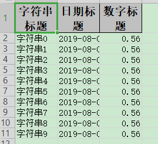
##### <span id="simpleWriteObject" />对象
```java
@Data
public class DemoData {
    @ExcelProperty("字符串标题")
    private String string;
    @ExcelProperty("日期标题")
    private Date date;
    @ExcelProperty("数字标题")
    private Double doubleData;
}
```
##### 代码
```java
    /**
     * 最简单的写
     * <p>1. 创建excel对应的实体对象 参照{@link DemoData}
     * <p>2. 直接写即可
     */
    @Test
    public void simpleWrite() {
        // 写法1
        String fileName = TestFileUtil.getPath() + "simpleWrite" + System.currentTimeMillis() + ".xlsx";
        // 这里 需要指定写用哪个class去读，然后写到第一个sheet，名字为模板 然后文件流会自动关闭
        // 如果这里想使用03 则 传入excelType参数即可
        EasyExcel.write(fileName, DemoData.class).sheet("模板").doWrite(data());

        // 写法2
        fileName = TestFileUtil.getPath() + "simpleWrite" + System.currentTimeMillis() + ".xlsx";
        // 这里 需要指定写用哪个class去读
        ExcelWriter excelWriter = EasyExcel.write(fileName, DemoData.class).build();
        WriteSheet writeSheet = EasyExcel.writerSheet("模板").build();
        excelWriter.write(data(), writeSheet);
        /// 千万别忘记finish 会帮忙关闭流
        excelWriter.finish();
    }
```

### <span id="indexWrite" />指定写入的列
##### excel示例
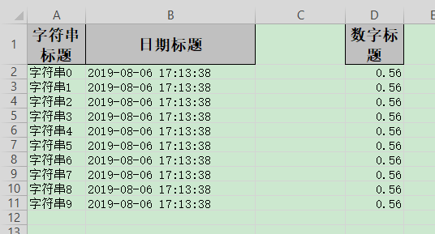
##### 对象
```java
@Data
public class IndexData {
    @ExcelProperty(value = "字符串标题", index = 0)
    private String string;
    @ExcelProperty(value = "日期标题", index = 1)
    private Date date;
    /**
     * 这里设置3 会导致第二列空的
     */
    @ExcelProperty(value = "数字标题", index = 3)
    private Double doubleData;
}
```
##### 代码
```java
    /**
     * 指定写入的列
     * <p>1. 创建excel对应的实体对象 参照{@link IndexData}
     * <p>2. 使用{@link ExcelProperty}注解指定写入的列
     * <p>3. 直接写即可
     */
    @Test
    public void indexWrite() {
        String fileName = TestFileUtil.getPath() + "indexWrite" + System.currentTimeMillis() + ".xlsx";
        // 这里 需要指定写用哪个class去读，然后写到第一个sheet，名字为模板 然后文件流会自动关闭
        EasyExcel.write(fileName, IndexData.class).sheet("模板").doWrite(data());
    }
```

### <span id="complexHeadWrite" />复杂头写入
##### excel示例
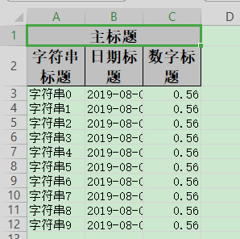
##### 对象
```java
@Data
public class ComplexHeadData {
    @ExcelProperty({"主标题", "字符串标题"})
    private String string;
    @ExcelProperty({"主标题", "日期标题"})
    private Date date;
    @ExcelProperty({"主标题", "数字标题"})
    private Double doubleData;
}
```
##### 代码
```java
    /**
     * 复杂头写入
     * <p>1. 创建excel对应的实体对象 参照{@link ComplexHeadData}
     * <p>2. 使用{@link ExcelProperty}注解指定复杂的头
     * <p>3. 直接写即可
     */
    @Test
    public void complexHeadWrite() {
        String fileName = TestFileUtil.getPath() + "complexHeadWrite" + System.currentTimeMillis() + ".xlsx";
        // 这里 需要指定写用哪个class去读，然后写到第一个sheet，名字为模板 然后文件流会自动关闭
        EasyExcel.write(fileName, ComplexHeadData.class).sheet("模板").doWrite(data());
    }
```

### <span id="repeatedWrite" />重复多次写入
##### excel示例
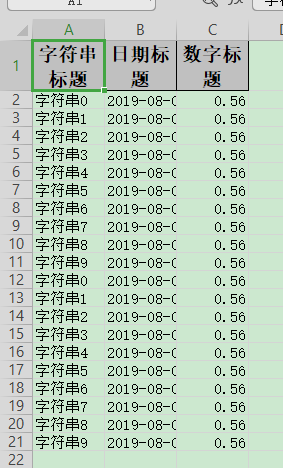
##### 对象
参照：[对象](#simpleWriteObject)
##### 代码
```java
  /**
     * 重复多次写入
     * <p>
     * 1. 创建excel对应的实体对象 参照{@link ComplexHeadData}
     * <p>
     * 2. 使用{@link ExcelProperty}注解指定复杂的头
     * <p>
     * 3. 直接调用二次写入即可
     */
    @Test
    public void repeatedWrite() {
        // 方法1 如果写到同一个sheet
        String fileName = TestFileUtil.getPath() + "repeatedWrite" + System.currentTimeMillis() + ".xlsx";
        // 这里 需要指定写用哪个class去读
        ExcelWriter excelWriter = EasyExcel.write(fileName, DemoData.class).build();
        // 这里注意 如果同一个sheet只要创建一次
        WriteSheet writeSheet = EasyExcel.writerSheet("模板").build();
        // 去调用写入,这里我调用了五次，实际使用时根据数据库分页的总的页数来
        for (int i = 0; i < 5; i++) {
            // 分页去数据库查询数据 这里可以去数据库查询每一页的数据
            List<DemoData> data = data();
            excelWriter.write(data, writeSheet);
        }
        /// 千万别忘记finish 会帮忙关闭流
        excelWriter.finish();

        // 方法2 如果写到不同的sheet 同一个对象
        fileName = TestFileUtil.getPath() + "repeatedWrite" + System.currentTimeMillis() + ".xlsx";
        // 这里 指定文件
        excelWriter = EasyExcel.write(fileName, DemoData.class).build();
        // 去调用写入,这里我调用了五次，实际使用时根据数据库分页的总的页数来。这里最终会写到5个sheet里面
        for (int i = 0; i < 5; i++) {
            // 每次都要创建writeSheet 这里注意必须指定sheetNo
            writeSheet = EasyExcel.writerSheet(i, "模板").build();
            // 分页去数据库查询数据 这里可以去数据库查询每一页的数据
            List<DemoData> data = data();
            excelWriter.write(data, writeSheet);
        }
        /// 千万别忘记finish 会帮忙关闭流
        excelWriter.finish();

        // 方法3 如果写到不同的sheet 不同的对象
        fileName = TestFileUtil.getPath() + "repeatedWrite" + System.currentTimeMillis() + ".xlsx";
        // 这里 指定文件
        excelWriter = EasyExcel.write(fileName).build();
        // 去调用写入,这里我调用了五次，实际使用时根据数据库分页的总的页数来。这里最终会写到5个sheet里面
        for (int i = 0; i < 5; i++) {
            // 每次都要创建writeSheet 这里注意必须指定sheetNo。这里注意DemoData.class 可以每次都变，我这里为了方便 所以用的同一个class 实际上可以一直变
            writeSheet = EasyExcel.writerSheet(i, "模板").head(DemoData.class).build();
            // 分页去数据库查询数据 这里可以去数据库查询每一页的数据
            List<DemoData> data = data();
            excelWriter.write(data, writeSheet);
        }
        /// 千万别忘记finish 会帮忙关闭流
        excelWriter.finish();
    }
```

### <span id="converterWrite" />日期、数字或者自定义格式转换
##### excel示例
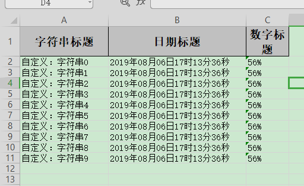
##### 对象
```java
@Data
public class ConverterData {
    /**
     * 我想所有的 字符串起前面加上"自定义："三个字
     */
    @ExcelProperty(value = "字符串标题", converter = CustomStringStringConverter.class)
    private String string;
    /**
     * 我想写到excel 用年月日的格式
     */
    @DateTimeFormat("yyyy年MM月dd日HH时mm分ss秒")
    @ExcelProperty("日期标题")
    private Date date;
    /**
     * 我想写到excel 用百分比表示
     */
    @NumberFormat("#.##%")
    @ExcelProperty(value = "数字标题")
    private Double doubleData;
}
```
##### 代码
```java
    /**
     * 日期、数字或者自定义格式转换
     * <p>1. 创建excel对应的实体对象 参照{@link ConverterData}
     * <p>2. 使用{@link ExcelProperty}配合使用注解{@link DateTimeFormat}、{@link NumberFormat}或者自定义注解
     * <p>3. 直接写即可
     */
    @Test
    public void converterWrite() {
        String fileName = TestFileUtil.getPath() + "converterWrite" + System.currentTimeMillis() + ".xlsx";
        // 这里 需要指定写用哪个class去读，然后写到第一个sheet，名字为模板 然后文件流会自动关闭
        EasyExcel.write(fileName, ConverterData.class).sheet("模板").doWrite(data());
    }
```

### <span id="imageWrite" />图片导出
##### excel示例
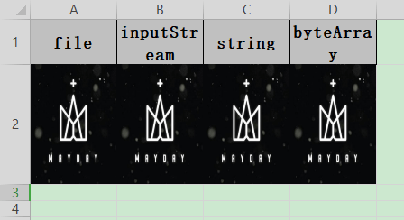
##### 对象
```java
@Data
@ContentRowHeight(100)
@ColumnWidth(100 / 8)
public class ImageData {
    private File file;
    private InputStream inputStream;
    /**
     * 如果string类型 必须指定转换器，string默认转换成string
     */
    @ExcelProperty(converter = StringImageConverter.class)
    private String string;
    private byte[] byteArray;
}
```
##### 代码
```java
    /**
     * 图片导出
     * <p>1. 创建excel对应的实体对象 参照{@link ImageData}
     * <p>2. 直接写即可
     */
    @Test
    public void imageWrite() throws Exception {
        String fileName = TestFileUtil.getPath() + "imageWrite" + System.currentTimeMillis() + ".xlsx";
        // 如果使用流 记得关闭
        InputStream inputStream = null;
        try {
            List<ImageData> list = new ArrayList<ImageData>();
            ImageData imageData = new ImageData();
            list.add(imageData);
            String imagePath = TestFileUtil.getPath() + "converter" + File.separator + "img.jpg";
            // 放入四种类型的图片 实际使用只要选一种即可
            imageData.setByteArray(FileUtils.readFileToByteArray(new File(imagePath)));
            imageData.setFile(new File(imagePath));
            imageData.setString(imagePath);
            inputStream = FileUtils.openInputStream(new File(imagePath));
            imageData.setInputStream(inputStream);
            EasyExcel.write(fileName, ImageData.class).sheet().doWrite(list);
        } finally {
            if (inputStream != null) {
                inputStream.close();
            }
        }
    }
```


### <span id="templateWrite" />根据模板写入
##### 模板excel示例
参照：[模板excel示例](#simpleReadExcel)
##### excel示例
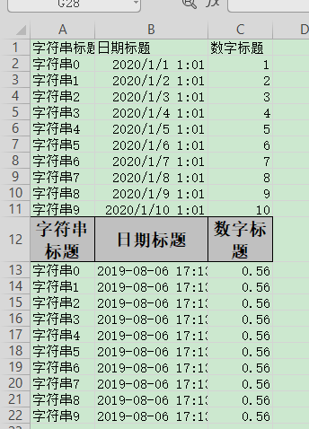
##### 对象
参照：[对象](#simpleWriteObject)
##### 代码
```java
    /**
     * 根据模板写入
     * <p>1. 创建excel对应的实体对象 参照{@link IndexData}
     * <p>2. 使用{@link ExcelProperty}注解指定写入的列
     * <p>3. 使用withTemplate 读取模板
     * <p>4. 直接写即可
     */
    @Test
    public void templateWrite() {
        String templateFileName = TestFileUtil.getPath() + "demo" + File.separator + "demo.xlsx";
        String fileName = TestFileUtil.getPath() + "templateWrite" + System.currentTimeMillis() + ".xlsx";
        // 这里 需要指定写用哪个class去读，然后写到第一个sheet，名字为模板 然后文件流会自动关闭
        EasyExcel.write(fileName, DemoData.class).withTemplate(templateFileName).sheet().doWrite(data());
    }
```

### <span id="widthAndHeightWrite" />列宽、行高
##### excel示例
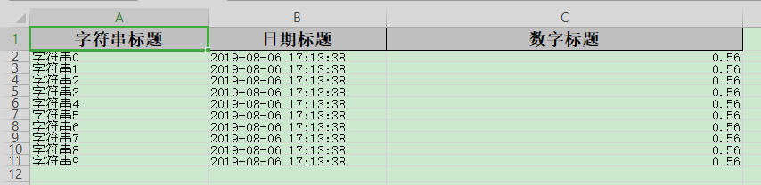
##### 对象
````java
@Data
@ContentRowHeight(10)
@HeadRowHeight(20)
@ColumnWidth(25)
public class WidthAndHeightData {
    @ExcelProperty("字符串标题")
    private String string;
    @ExcelProperty("日期标题")
    private Date date;
    /**
     * 宽度为50
     */
    @ColumnWidth(50)
    @ExcelProperty("数字标题")
    private Double doubleData;
}
````
##### 代码
```java
    /**
     * 列宽、行高
     * <p>1. 创建excel对应的实体对象 参照{@link WidthAndHeightData}
     * <p>2. 使用注解{@link ColumnWidth}、{@link HeadRowHeight}、{@link ContentRowHeight}指定宽度或高度
     * <p>3. 直接写即可
     */
    @Test
    public void widthAndHeightWrite() {
        String fileName = TestFileUtil.getPath() + "widthAndHeightWrite" + System.currentTimeMillis() + ".xlsx";
        // 这里 需要指定写用哪个class去读，然后写到第一个sheet，名字为模板 然后文件流会自动关闭
        EasyExcel.write(fileName, WidthAndHeightData.class).sheet("模板").doWrite(data());
    }
```

### <span id="styleWrite" />自定义样式
##### excel示例
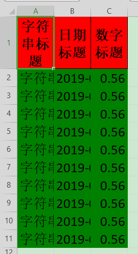
##### 对象
参照：[对象](#simpleWriteObject)
##### 代码
```java
    /**
     * 自定义样式
     * <p>1. 创建excel对应的实体对象 参照{@link DemoData}
     * <p>2. 创建一个style策略 并注册
     * <p>3. 直接写即可
     */
    @Test
    public void styleWrite() {
        String fileName = TestFileUtil.getPath() + "styleWrite" + System.currentTimeMillis() + ".xlsx";
        // 头的策略
        WriteCellStyle headWriteCellStyle = new WriteCellStyle();
        // 背景设置为红色
        headWriteCellStyle.setFillForegroundColor(IndexedColors.RED.getIndex());
        WriteFont headWriteFont = new WriteFont();
        headWriteFont.setFontHeightInPoints((short)20);
        headWriteCellStyle.setWriteFont(headWriteFont);
        // 内容的策略
        WriteCellStyle contentWriteCellStyle = new WriteCellStyle();
        // 这里需要指定 FillPatternType 为FillPatternType.SOLID_FOREGROUND 不然无法显示背景颜色.头默认了 FillPatternType所以可以不指定
        contentWriteCellStyle.setFillPatternType(FillPatternType.SOLID_FOREGROUND);
        // 背景绿色
        contentWriteCellStyle.setFillForegroundColor(IndexedColors.GREEN.getIndex());
        WriteFont contentWriteFont = new WriteFont();
        // 字体大小
        contentWriteFont.setFontHeightInPoints((short)20);
        contentWriteCellStyle.setWriteFont(contentWriteFont);
        // 这个策略是 头是头的样式 内容是内容的样式 其他的策略可以自己实现
        HorizontalCellStyleStrategy horizontalCellStyleStrategy =
            new HorizontalCellStyleStrategy(headWriteCellStyle, contentWriteCellStyle);

        // 这里 需要指定写用哪个class去读，然后写到第一个sheet，名字为模板 然后文件流会自动关闭
        EasyExcel.write(fileName, DemoData.class).registerWriteHandler(horizontalCellStyleStrategy).sheet("模板")
            .doWrite(data());
    }
```

### <span id="mergeWrite" />合并单元格
##### excel示例
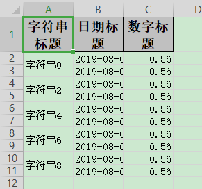
##### 对象
参照：[对象](#simpleWriteObject)
##### 代码
```java
   /**
     * 合并单元格
     * <p>1. 创建excel对应的实体对象 参照{@link DemoData}
     * <p>2. 创建一个merge策略 并注册
     * <p>3. 直接写即可
     */
    @Test
    public void mergeWrite() {
        String fileName = TestFileUtil.getPath() + "mergeWrite" + System.currentTimeMillis() + ".xlsx";
        // 每隔2行会合并 把eachColumn 设置成 3 也就是我们数据的长度，所以就第一列会合并。当然其他合并策略也可以自己写
        LoopMergeStrategy loopMergeStrategy = new LoopMergeStrategy(2, 0);
        // 这里 需要指定写用哪个class去读，然后写到第一个sheet，名字为模板 然后文件流会自动关闭
        EasyExcel.write(fileName, DemoData.class).registerWriteHandler(loopMergeStrategy).sheet("模板")
            .doWrite(data());
    }
```

### <span id="tableWrite" />使用table去写入
##### excel示例
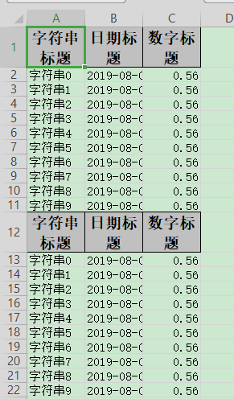
##### 对象
参照：[对象](#simpleWriteObject)
##### 代码
```java
   /**
     * 使用table去写入
     * <p>1. 创建excel对应的实体对象 参照{@link DemoData}
     * <p>2. 然后写入table即可
     */
    @Test
    public void tableWrite() {
        String fileName = TestFileUtil.getPath() + "tableWrite" + System.currentTimeMillis() + ".xlsx";
        // 这里直接写多个table的案例了，如果只有一个 也可以直一行代码搞定，参照其他案例
        // 这里 需要指定写用哪个class去读
        ExcelWriter excelWriter = EasyExcel.write(fileName, DemoData.class).build();
        // 把sheet设置为不需要头 不然会输出sheet的头 这样看起来第一个table 就有2个头了
        WriteSheet writeSheet = EasyExcel.writerSheet("模板").needHead(Boolean.FALSE).build();
        // 这里必须指定需要头，table 会继承sheet的配置，sheet配置了不需要，table 默认也是不需要
        WriteTable writeTable0 = EasyExcel.writerTable(0).needHead(Boolean.TRUE).build();
        WriteTable writeTable1 = EasyExcel.writerTable(1).needHead(Boolean.TRUE).build();
        // 第一次写入会创建头
        excelWriter.write(data(), writeSheet, writeTable0);
        // 第二次写如也会创建头，然后在第一次的后面写入数据
        excelWriter.write(data(), writeSheet, writeTable1);
        /// 千万别忘记finish 会帮忙关闭流
        excelWriter.finish();
    }
```

### <span id="tableWrite" />动态头，实时生成头写入
##### excel示例
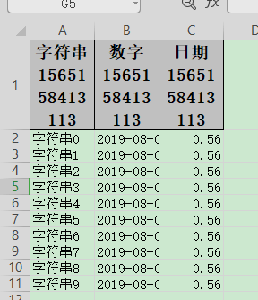
##### 对象
参照：[对象](#simpleWriteObject)
##### 代码
```java
    /**
     * 动态头，实时生成头写入
     * <p>
     * 思路是这样子的，先创建List<String>头格式的sheet仅仅写入头,然后通过table 不写入头的方式 去写入数据
     *
     * <p>
     * 1. 创建excel对应的实体对象 参照{@link DemoData}
     * <p>
     * 2. 然后写入table即可
     */
    @Test
    public void dynamicHeadWrite() {
        String fileName = TestFileUtil.getPath() + "dynamicHeadWrite" + System.currentTimeMillis() + ".xlsx";
        EasyExcel.write(fileName)
            // 这里放入动态头
            .head(head()).sheet("模板")
            // 当然这里数据也可以用 List<List<String>> 去传入
            .doWrite(data());
    }

    private List<List<String>> head() {
        List<List<String>> list = new ArrayList<List<String>>();
        List<String> head0 = new ArrayList<String>();
        head0.add("字符串" + System.currentTimeMillis());
        List<String> head1 = new ArrayList<String>();
        head1.add("数字" + System.currentTimeMillis());
        List<String> head2 = new ArrayList<String>();
        head2.add("日期" + System.currentTimeMillis());
        list.add(head0);
        list.add(head1);
        list.add(head2);
        return list;
    }
```

### <span id="longestMatchColumnWidthWrite" />自动列宽(不太精确)
##### excel示例
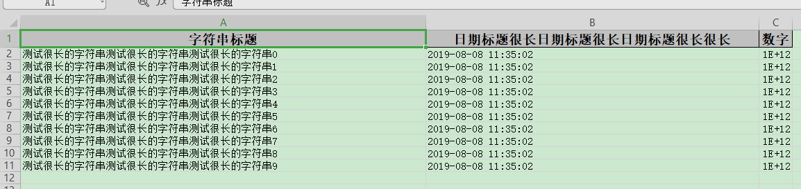
##### 对象
```java
@Data
public class LongestMatchColumnWidthData {
    @ExcelProperty("字符串标题")
    private String string;
    @ExcelProperty("日期标题很长日期标题很长日期标题很长很长")
    private Date date;
    @ExcelProperty("数字")
    private Double doubleData;
}
```
##### 代码
```java
   /**
     * 自动列宽(不太精确)
     * <p>
     * 这个目前不是很好用，比如有数字就会导致换行。而且长度也不是刚好和实际长度一致。 所以需要精确到刚好列宽的慎用。 当然也可以自己参照
     * {@link LongestMatchColumnWidthStyleStrategy}重新实现.
     * <p>
     * poi 自带{@link SXSSFSheet#autoSizeColumn(int)} 对中文支持也不太好。目前没找到很好的算法。 有的话可以推荐下。
     *
     * <p>
     * 1. 创建excel对应的实体对象 参照{@link LongestMatchColumnWidthData}
     * <p>
     * 2. 注册策略{@link LongestMatchColumnWidthStyleStrategy}
     * <p>
     * 3. 直接写即可
     */
    @Test
    public void longestMatchColumnWidthWrite() {
        String fileName =
            TestFileUtil.getPath() + "longestMatchColumnWidthWrite" + System.currentTimeMillis() + ".xlsx";
        // 这里 需要指定写用哪个class去读，然后写到第一个sheet，名字为模板 然后文件流会自动关闭
        EasyExcel.write(fileName, LongestMatchColumnWidthData.class)
            .registerWriteHandler(new LongestMatchColumnWidthStyleStrategy()).sheet("模板").doWrite(dataLong());
    }

    private List<LongestMatchColumnWidthData> dataLong() {
        List<LongestMatchColumnWidthData> list = new ArrayList<LongestMatchColumnWidthData>();
        for (int i = 0; i < 10; i++) {
            LongestMatchColumnWidthData data = new LongestMatchColumnWidthData();
            data.setString("测试很长的字符串测试很长的字符串测试很长的字符串" + i);
            data.setDate(new Date());
            data.setDoubleData(1000000000000.0);
            list.add(data);
        }
        return list;
    }
```

### <span id="customHandlerWrite" />自定义拦截器（上面几点都不符合但是要对单元格进行操作的参照这个）
##### excel示例
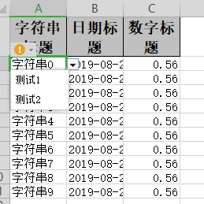
##### 对象
参照：[对象](#simpleWriteObject)
##### 定义拦截器
````java
/**
 * 自定义拦截器。对第一行第一列的头超链接到:https://github.com/alibaba/easyexcel
 *
 * @author Jiaju Zhuang
 */
public class CustomCellWriteHandler implements CellWriteHandler {

    private static final Logger LOGGER = LoggerFactory.getLogger(CustomCellWriteHandler.class);

    @Override
    public void beforeCellCreate(WriteSheetHolder writeSheetHolder, WriteTableHolder writeTableHolder, Row row,
        Head head, int relativeRowIndex, boolean isHead) {

    }

    @Override
    public void afterCellCreate(WriteSheetHolder writeSheetHolder, WriteTableHolder writeTableHolder, CellData cellData,
        Cell cell, Head head, int relativeRowIndex, boolean isHead) {
        // 这里可以对cell进行任何操作
        LOGGER.info("第{}行，第{}列写入完成。", cell.getRowIndex(), cell.getColumnIndex());
        if (isHead && cell.getColumnIndex() == 0) {
            CreationHelper createHelper = writeSheetHolder.getSheet().getWorkbook().getCreationHelper();
            Hyperlink hyperlink = createHelper.createHyperlink(HyperlinkType.URL);
            hyperlink.setAddress("https://github.com/alibaba/easyexcel");
            cell.setHyperlink(hyperlink);
        }
    }

}
````
````java
/**
 * 自定义拦截器.对第一列第一行和第二行的数据新增下拉框，显示 测试1 测试2
 *
 * @author Jiaju Zhuang
 */
public class CustomSheetWriteHandler implements SheetWriteHandler {

    private static final Logger LOGGER = LoggerFactory.getLogger(CustomSheetWriteHandler.class);

    @Override
    public void beforeSheetCreate(WriteWorkbookHolder writeWorkbookHolder, WriteSheetHolder writeSheetHolder) {

    }

    @Override
    public void afterSheetCreate(WriteWorkbookHolder writeWorkbookHolder, WriteSheetHolder writeSheetHolder) {
        LOGGER.info("第{}个Sheet写入成功。", writeSheetHolder.getSheetNo());

        // 区间设置 第一列第一行和第二行的数据。由于第一行是头，所以第一、二行的数据实际上是第二三行
        CellRangeAddressList cellRangeAddressList = new CellRangeAddressList(1, 2, 0, 0);
        DataValidationHelper helper = writeSheetHolder.getSheet().getDataValidationHelper();
        DataValidationConstraint constraint = helper.createExplicitListConstraint(new String[] {"测试1", "测试2"});
        DataValidation dataValidation = helper.createValidation(constraint, cellRangeAddressList);
        writeSheetHolder.getSheet().addValidationData(dataValidation);
    }
}

````
##### 代码
```java
    /**
     * 下拉，超链接等自定义拦截器（上面几点都不符合但是要对单元格进行操作的参照这个）
     * <p>
     * demo这里实现2点。1. 对第一行第一列的头超链接到:https://github.com/alibaba/easyexcel 2. 对第一列第一行和第二行的数据新增下拉框，显示 测试1 测试2
     * <p>
     * 1. 创建excel对应的实体对象 参照{@link DemoData}
     * <p>
     * 2. 注册拦截器 {@link CustomCellWriteHandler} {@link CustomSheetWriteHandler}
     * <p>
     * 2. 直接写即可
     */
    @Test
    public void customHandlerWrite() {
        String fileName = TestFileUtil.getPath() + "customHandlerWrite" + System.currentTimeMillis() + ".xlsx";
        // 这里 需要指定写用哪个class去读，然后写到第一个sheet，名字为模板 然后文件流会自动关闭
        EasyExcel.write(fileName, DemoData.class).registerWriteHandler(new CustomSheetWriteHandler())
            .registerWriteHandler(new CustomCellWriteHandler()).sheet("模板").doWrite(data());
    }
```

### <span id="webWrite" />web中的写
##### 示例代码
DEMO代码地址：[https://github.com/alibaba/easyexcel/blob/master/src/test/java/com/alibaba/easyexcel/test/demo/web/WebTest.java](/src/test/java/com/alibaba/easyexcel/test/demo/web/WebTest.java)
##### 对象
参照：[对象](#simpleWriteObject) 就是名称变了下
##### 代码
```java
    /**
     * 文件下载
     * <p>
     * 1. 创建excel对应的实体对象 参照{@link DownloadData}
     * <p>
     * 2. 设置返回的 参数
     * <p>
     * 3. 直接写，这里注意，finish的时候会自动关闭OutputStream,当然你外面再关闭流问题不大
     */
    @GetMapping("download")
    public void download(HttpServletResponse response) throws IOException {
        // 这里注意 有同学反应下载的文件名不对。这个时候 请别使用swagger 他会有影响
        response.setContentType("application/vnd.ms-excel");
        response.setCharacterEncoding("utf-8");
        // 这里URLEncoder.encode可以防止中文乱码 当然和easyexcel没有关系
        String fileName = URLEncoder.encode("测试", "UTF-8");
        response.setHeader("Content-disposition", "attachment;filename=" + fileName + ".xlsx");
        EasyExcel.write(response.getOutputStream(), DownloadData.class).sheet("模板").doWrite(data());
    }
```
## 测试数据分析


从上面的性能测试可以看出easyexcel在解析耗时上比poiuserModel模式弱了一些。主要原因是我内部采用了反射做模型字段映射，中间我也加了cache，但感觉这点差距可以接受的。但在内存消耗上差别就比较明显了，easyexcel在后面文件再增大，内存消耗几乎不会增加了。但poi userModel就不一样了，简直就要爆掉了。想想一个excel解析200M，同时有20个人再用估计一台机器就挂了。

