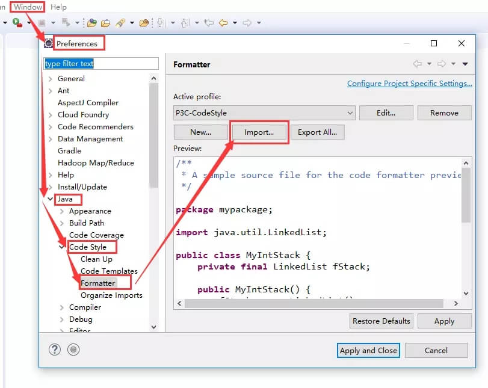
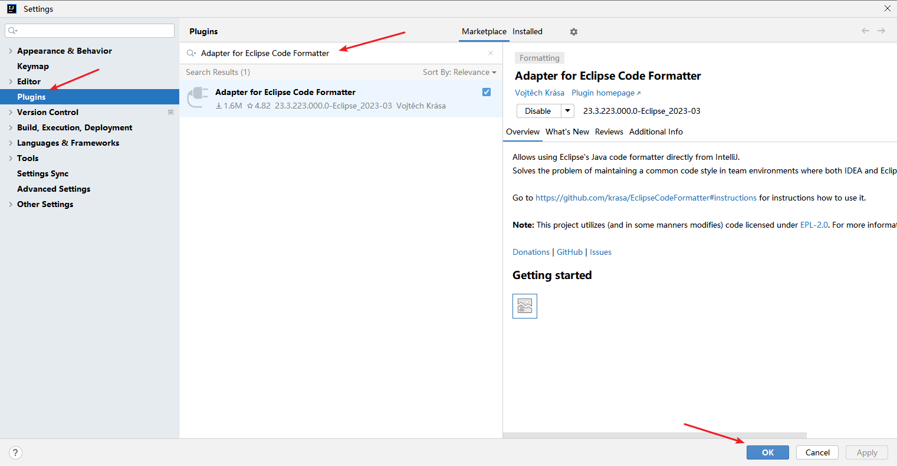
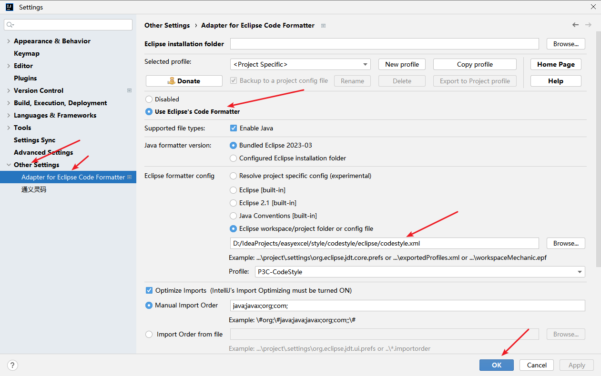
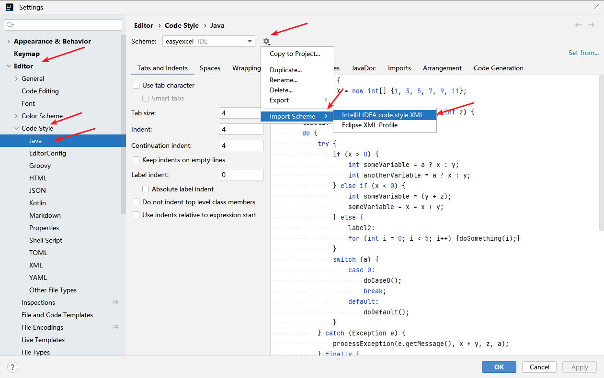

## 统一代码风格
如果要编辑本项目，一定要统一代码风格
### 统一方案
本工程代码遵守阿里巴巴[p3c](https://github.com/alibaba/p3c)规范，在代码开发前建议:
* 安装阿里巴巴规约插件,用于提早发现不规范代码,具体安装方法参照:[p3c](https://github.com/alibaba/p3c)，里面有eclipse,idea的安装方法
* 安装codeStyle插件,用于格式化代码的时候符合代码规范,安装方法见:[安装codeStyle插件](#codeStyleInstall)
* checkStyle校验,这个不用安装,`mvn`在编译的时候自己会调用，写在`pom.xml`里，用`maven-pmd-plugin`调用`pmd-p3c`规范校验

如果工作中遇到代码格式化问题，经常导致git冲突,也可以采用上面的方案
### codeStyle插件安装
这里注意下，不管eclipse或者idea，都需要导入eclipse文件夹下面的配置
#### eclipse
* 依次点击：`Window->Preferences->Java->Code Style->Formatter->Import`
* 选择`style/eclipse/codestyle.xml`文件 确定
* 默认在`Active profile`中选择新导入的`P3C-CodeStyle`，如未选择，请手动选择
* 点击`Apply`完成配置

#### idea
* 依次点击进入插件界面：`File->Settings->Plugins`，搜索 eclipse code formatter，如已有插件则不需安装，如没有，点击Search in repositories自动搜索线上插件。

* 导入`style/eclipse/codestyle.xml` 这里记住用的也是eclipse里面的 点击OK

* 依次点击进入插件界面：`File->Settings->Editor->Code Style->Java->Import Scheme->Intellij IDEA code style XML`，导入`style/idea/codestyle.xml` 这里用的是idea的配置文件

* 完成

### 附
#### windows系统,代码规范校验提示乱码
这个是因为cmd默认gbk，cmd输入:`CHCP 65001` 在运行mvn 提示就是不会乱码了